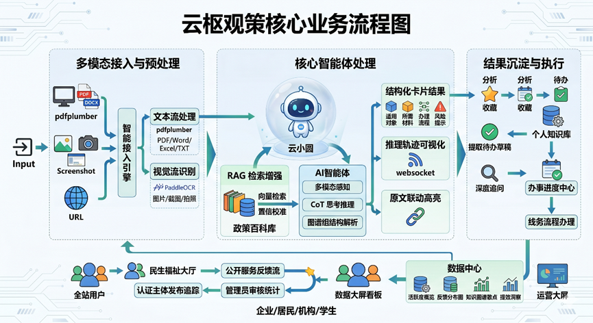
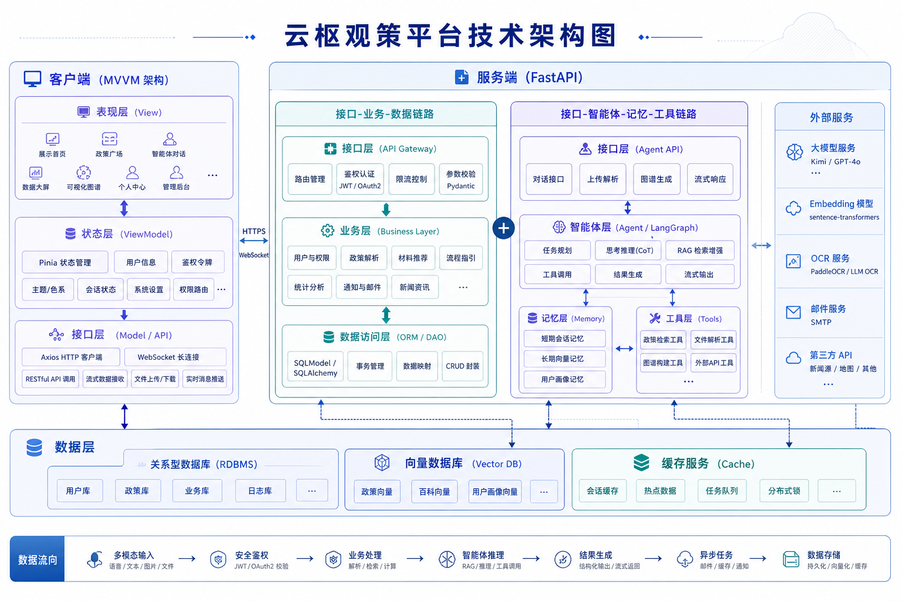
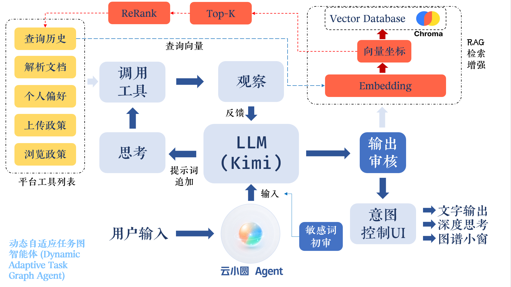
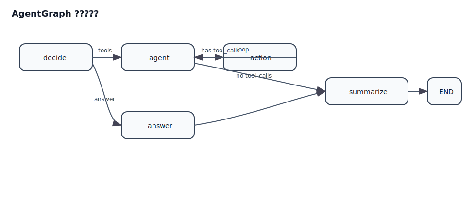
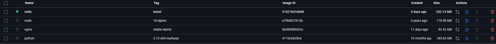

<video src="./doc/2026054264-参赛总文件夹/2026054264-04%20作品演示视频/云枢观策演示视频.mp4" controls width="100%"></video>

# 云枢观策 - 民生政策与服务一体化平台
>  让政策不再停留在纸面，让民生服务真正抵达每个人。  

## 软件宗旨 (Project Mission)
**云枢观策平台**是一个集政策文件云端共享、人工智能结构化解读与用户服务评价于一体的综合性办事与调研平台。我们致力于改变传统政策信息单向下发且冗长复杂的现状，通过打造“多方上传-智能提取-服务评价”的完整功能机制，解决不同社会群体在获取和执行公共政策时面临的实际困难。不同用户不再因难以提取关键要素而影响办事效率；学生与职场人员不再遗漏繁杂通知中的截止日期和所需材料；普通居民也能减少因政策理解偏差导致的多次往返跑现象。

本平台致力于通过先进的人工智能技术与多角色协同机制，构建一个全场景的政策信息流转生态与办事辅助平台。本项目的核心宗旨在于重塑政策信息的产生、传递与消费链路，建立完整的"**共享-解读-服务-协同**"社会交互流程：

1. **形成云端政策共享广场** 平台彻底打破传统的单向信息发布壁垒，允许各方主体在完成身份认证后，主动将获取到的政策文件、惠企政策和社区通知上传至云端进行全站共享，建立开放透明的政策数据矩阵。

2. **利用新质生产力智能体解读政策** 面对云端海量的复杂公文，平台调用基于大型语言模型和 RAG 检索增强生成的 Agent 智能体。这些代表新质生产力的技术引擎能够瞬间剥离冗余信息，将长篇大论自动解析为通俗易懂的办理条件、流程清单和风险提示卡片。

3. **构建服务评价机制并在广场展示用户反馈** 用户在浏览解析后的政策卡片时，不仅可以获取办事指南，还可以直接针对政策的落地情况、解析的准确度进行评价、留言与纠错。这些交互数据会实时汇聚并在全民政策广场中公开展示，形成真实的用户反馈流。

4. **推动公共服务优化落地** 通过政策信息的充分公开、智能技术的赋能以及用户评价的持续汇聚，平台让每一位普通用户和企业主体都能更高效地参与政策理解、服务获取与问题纠正，利用数字化手段推动基层公共服务流程的持续优化落地。

---

## 社会痛点 (Social Pain Points)

### 企业政策痛点
- **政策来源分散，触达效率低** 惠企政策、产业扶持通知、申报公告往往分散在不同部门网站、公众号、平台入口和附件文件中，中小微企业难以及时、完整地获取信息。
- **文件冗长专业，理解门槛高** 企业在阅读政策时，往往最关心“是否适用、如何申报、材料是什么、截止到何时”，但传统公文以规范表达为主，真正可执行的信息提取成本很高。
- **申报流程复杂，试错成本高** 同一项政策往往伴随多轮材料补充、资格核验与窗口办理，中小企业缺乏专门政策研究人员，容易因为理解偏差、材料遗漏而错失窗口期。
- **政策效果难追踪，经验难沉淀** 企业即使完成一次申报，也很难把零散的政策文本、办理经验和结果反馈沉淀为可复用的知识，导致重复学习、重复试错。

### 基层政策痛点
- **基层通知分散在线上线下多个渠道** 社区公告、街道通知、学校提醒、园区办事指南既可能出现在纸质公告栏，也可能出现在群聊、截图、转发消息中，信息入口零散且不统一。
- **重点信息不突出，群众容易遗漏** 截止时间、办理地点、适用对象、所需材料等关键信息常埋在长文本或图片扫描件中，大多数用户都很难快速抓住重点。
- **非结构化材料多，理解依赖人工整理** 很多基层政策以 PDF 扫描件、拍照图片、表格附件等形式流转，群众往往需要手动比对、逐条摘录，办理前准备成本高。
- **反馈难形成闭环，服务优化缺少依据** 群众在实际办理中遇到的问题、误解点和高频疑问如果无法及时汇聚，就难以反哺通知优化、流程改进和后续服务设计。

---

## 核心功能详解

#### 展示首页与业务系统双入口协同
当前平台已经形成“展示入口 + 业务入口”并行的产品结构。用户首次访问系统时，首先进入 `/showcase` 展示首页，可快速了解平台定位、功能亮点与可视化成果；继续深入后，还可进入展示版发现页与数据大屏，查看全站级别的解析活跃度、认证主体覆盖、公开内容流转与典型应用场景。这一结构既适合比赛展示、答辩讲解和公共演示，也保留了面向真实使用的业务主系统入口。用户从展示层点击进入系统后，则会默认抵达智能体工作区，直接进入“上传材料、开始解析、发起对话、沉淀结果”的核心使用链路，实现从“看项目”到“用系统”的自然切换。

#### 多模态扫描与可视化解析工作台
平台主页已经不再是传统意义上的上传页，而是一个围绕“扫描入口 + 可视化结果”构建的多模态政策解析工作台。用户既可以通过本地上传提交 PDF、Word、Excel、图片与文本材料，也可以直接使用 URL 上传与截图上传，将网页公告、移动端截图、扫描件和纸质布告栏拍照内容纳入统一处理链路。系统在解析过程中会同步展示实时进度条、阶段状态、耗时指标与任务推进信息，减少用户在长文本处理过程中的等待焦虑。与此同时，主页左侧集成“最近解析”抽屉，右侧整合“中央文件/时事热点”侧栏，中部提供示例区与上传入口，使用户在开始新任务前即可快速参考历史、浏览重点政策、套用示例材料，形成一个高频、集中、可直接上手的扫描工作台。

当材料进入解析链路后，平台的重点不只是“提取文字”，而是把复杂通知转化为直观、可读、可交互的可视化结果。系统能够将适用对象、办理事项、所需材料、流程步骤、风险提醒等核心要素结构化呈现，并结合知识图谱、标签信息、原文回看、改写版本切换、收藏导出等能力，把原本冗长的政策文本重构为具有层次感和操作感的结果界面。对于格式混乱、结构不规整或信息缺失的文档，系统还具备自由结构解析与容错回退机制，保证结果尽可能稳定可用。这样一来，主页就不仅是一个“上传入口”，更是一个从多模态扫描、智能解读到可视化回显的完整处理中枢。

#### 可解释智能体对话与实时推理轨迹
除了静态文档解析，平台还建设了独立的智能体系统页 `/agent`，提供更强的连续对话与复杂任务处理能力。该页面支持 Agent 与 Chat 双模式切换，用户既可以像传统聊天一样直接提问，也可以让智能体围绕上传材料展开分步骤处理。系统通过 WebSocket 与后端保持长连接，在对话过程中实时推送推理轨迹、工具调用过程与答案正文，用户可随时打开侧边的“推理轨迹”面板查看智能体正在经历哪些分析步骤。与一般的黑盒式问答不同，云枢观策把“智能体是如何得到结论的”同步展示给用户，同时提供历史会话切换、会话删除、断线重连、文件伴随对话上传等能力，使智能体真正具备可解释、可持续、可运营的使用体验。

#### 结果复用、证据追溯与多版本阅读
系统并不把解析结果停留在一次性展示层面，而是进一步提供结果复用能力。用户可以查看原文内容、导出会话 JSON、导入既有会话、恢复历史解析，并把重点内容一键收藏。对于生成出的自由结构解析与图谱结果，平台支持收藏、再次进入办理链路，以及在不同阅读方式之间切换，使一次解析能够持续服务后续工作。系统同时保留原文与解析结果之间的关联，使用户在阅读办理步骤时，仍可回溯到对应的文本来源，避免“看到了结论，却找不到依据”的断层。对需要快速传播或转述的场景，平台还提供不同风格的改写版本与语音播报能力，方便用户按对象、场景和阅读习惯选择最合适的表达方式。

#### 发现页、热点资讯与全景政策广场
为了解决“政策文件在哪里、哪些值得看、哪些已经公开发布”的入口问题，平台建设了完整的发现页体系。系统发现页整合了资讯列表、热点文件 Top 5、搜索入口、功能中心与全景政策广场，既承接当前热点信息流，也承接经过审核后的真实政策文件公开展示链路。用户可以像浏览内容平台一样查看时事热点与重点文件，也可以在“全景政策广场”中浏览认证主体上传、管理员审核通过后的政策文本。配合独立的“政策推荐阅读”页面，平台进一步把中央文件、热点资讯、推荐阅读和全文详情展开结合起来，构成“资讯入口 + 文件入口 + 推荐阅读 + 深度查看”的完整发现机制，提升政策内容的可见性与可达性。

#### 认证主体发布与审核闭环
平台目前已实现从“认证主体上传”到“管理员审核”再到“公开展示与追踪分析”的完整闭环。具备认证主体身份的用户可以进入政策发布中心，按照标准化表单上传政策文件、填写标题摘要和附加信息，系统会将其纳入待审核链路。管理员审核通过后，文件将进入公开展示区域，并自动进入智能解析与统计体系。与此同时，认证主体还可以在“发布数据追踪”页面查看自己发布内容对应的落地评价、解析纠错和办事留言，掌握文件发布后的触达效果与使用反馈。这使平台不只是“读文件”的工具，也成为“发文件、看流转、追后效”的业务平台。

#### 办事进度中心、会话历史与收藏沉淀
围绕“看懂之后怎么继续办”这一关键问题，系统已经提供了多个后续承接模块。办事进度中心会接收 AI 解析结果中提炼出的待办草稿，用户可以在确认后保存为正式任务，逐步管理自己的办理进度。会话历史页面不仅区分通知解析与智能体对话两类记录，还支持历史恢复、收藏操作与会话导入导出，帮助用户把过去做过的解析转化为可反复调用的工作资产。收藏页则进一步将重点解析结果沉淀为个人知识库，避免重要材料在多轮办理中重复查找、重复整理。配合个人中心中的最近解析、最近收藏、待办摘要与行为洞察，平台已经初步形成“解析一次，沉淀长期可用资产”的个人工作闭环。

#### 民生福祉大厅与公开服务反馈链路
平台并不把系统价值局限于文档处理本身，而是进一步面向服务落地构建公开反馈场景。民生福祉大厅集中展示全站用户围绕政策文件形成的落地评价、解析纠错与办事留言，让后续浏览者在查看政策时，不只看到原文和机器解析结果，也能看到实际使用中的问题点、歧义点和高频关注点。认证主体还拥有与自身发布内容相关的专属视图，能够及时识别哪些环节最容易引发理解偏差、哪些材料要求最常引起疑问、哪些办事留言值得进一步优化说明。这样一来，平台把“用户阅读”向前推进到“服务感知”，把“内容公开”向后延展到“后效观察”，从而形成更贴近民生服务场景的数字闭环。

#### 管理员控制台与数据分析看板
在管理侧，平台已经不再停留于简单的用户增删改查，而是建设了较为完整的运营与数据看板能力。管理员控制台能够查看用户角色结构、总解析次数、各用户解析量、反馈类别分布与系统运行概况，对认证主体、普通用户和管理员的权限关系进行统一管理。独立的数据分析页面与展示大屏则进一步把个人效率收益、全站解析活跃度、公开展示链路占比、热点内容流转和反馈结构变化做成可视化结果。通过这些页面，平台不仅服务于普通用户的办事体验，也为上层运营、比赛展示、项目汇报和后续系统优化提供了直接的数据支撑。

#### 个性化设置、视觉系统与全端适配
随着页面与功能不断扩展，平台也已经形成了较成熟的界面系统。系统设置页除了提供基本账户信息管理外，还支持明亮、深色与跟随系统三种主题模式，以及经典红、酒红珊瑚、珊瑚蓝三套全局色系方案。色系切换并非局部换肤，而是覆盖 Header、展示页、首页、发现页、设置页、收藏页、待办页等核心视图，使整个平台具备统一的品牌外观与可持续扩展的视觉基础。与此同时，多个页面已经完成移动端与窄屏适配，涵盖首页抽屉、资讯区块、设置页、历史页、收藏页、待办页与民生福祉大厅等常用模块，确保用户在比赛演示、桌面办公与移动访问场景下都能获得稳定一致的使用体验。

---

## 技术与架构
### **核心技术 (Key Technologies)**
本项目采用面向民生政策解析与服务落地的企业级智能服务架构，围绕多模态接入、异步推理编排、知识增强检索、可视化呈现与业务闭环治理，构建完整的一体化处理体系。

#### **1. 前端表现层 (Client Side - Vue3 生态)**
* **响应式框架**：基于 **Vue 3 (Composition API)** 与 **Vite** 构建，采用 **MVVM** 设计模式，确保界面在高负载 AI 数据流下的流畅渲染。
* **状态与路由**：使用 **Pinia** 进行全局状态管理（用户信息、鉴权令牌、明暗主题切换），**Vue Router** 实现基于角色的动态权限路由控制。
* **展示与业务双入口分层**：前端同时承载 `/showcase` 展示首页、政策广场、数据大屏与 `/agent` 智能体页、`/admin` 管理后台等业务模块，形成“展示入口 + 系统入口”并行的产品架构，适配项目演示、公开展示与实际使用三类场景。
* **品牌外观系统**：在明暗模式之外，进一步实现基于 **Pinia + localStorage + 用户设置持久化** 的全局色系管理机制，当前支持 `classic`、`wine-coral`、`coral` 多套品牌色系，并贯穿展示页头部、系统 Header、设置页与个人中心。
* **实时交互链路**：智能体页面通过 **WebSocket** 与后端保持长连接，支持推理轨迹分段展示、结果流式输出、会话持久化恢复与前端最小可读时长控制，提升智能体交互的可解释性与稳定性。
* **多模态感知 (Perception)**：
    * **语音交互**：集成 **Web Audio API**，实现实时语音录入与指令识别，适配大众化办事与信息查询场景。
    * **视觉解析**：通过 **Canvas API** 结合前端 OCR 预处理，支持直接截屏上传政策公告并提取文字。
    * **结果播报**：内置 **TTS (Text-to-Speech)** 引擎，为用户提供自由结构解析与图谱结果的语音朗读功能。
* **数据可视化**：利用 **ECharts 5.0** 绘制动态图表，包含个人/全体用户节省时间趋势的双线图、高频材料词云及通知难度评估雷达图。
* **工程化前端工具链**：项目已接入 **Vitest** 单元测试能力，以及 **ESLint / OXlint / Prettier** 前端规范化工具链，保障展示页、业务页与公共组件在持续迭代中的可维护性。
* **图片预加载策略**：针对 `/showcase` 展示首页与 `/discovery-home` 政策广场，前端额外实现了“首屏优先 + 空闲预热”的图片加载机制。展示首页由于采用单屏切换式舞台结构，后续章节组件不会在初次进入时挂载，因此项目会在页面进入后通过统一的 `imagePreload` 工具对后续关键图片执行空闲预热，避免用户切到对应章节时才开始首请求；政策广场则对顶部轮播图和首屏资讯封面进行预热，同时将首屏可见图片标记为 `eager/high priority`，其余更深层列表继续保持 `lazy/low priority`，从而在保证首屏流畅度的前提下，减少“滑到哪里才开始加载图片”的体感延迟，也避免一次性粗暴拉取全站图片带来的带宽挤占。


#### **2. 后端核心层 (Server Side - FastAPI 异步架构)**
* **异步引擎**：基于 **FastAPI** 的高性能异步特性，采用“接口-业务-数据-智能”四层架构，完美适配长连接的 LLM 请求。
* **智能中枢 (AI Orchestration)**：
    * **智能体 Agent**：基于 **LangChain** 封装，支持 **Chain-of-Thought (CoT)** 思考过程展示，具备逻辑拆解与自主决策能力。
    * **RAG 增强检索**：集成 **ChromaDB** 向量数据库，通过语义搜索政策法规原文，从根本上解决 AI 幻觉问题。
    * **模型路由**：统一适配层对接 Moonshot (Kimi)、GPT-4o 等主流大模型，支持按需动态切换。
* **数据持久化**：使用 **SQLModel (SQLAlchemy)** 进行对象关系映射，配合 **SQLite** 存储结构化通知数据与用户记录。
* **异步任务管理**：集成 **Redis** 作为消息代理，处理 **真实邮件系统 (SMTP)** 的异步发送（如权限申请通知、效率周报）及高频热点资讯缓存。
* **Agent 插件化架构**：在基础 AI 链路之上，项目进一步落地了基于 **LangGraph** 的通用 Agent 插件系统，具备短期会话记忆、长期向量记忆、工具注册、图谱输出与流式执行能力，并在应用启动阶段进行 AgentGraph 生成与插件预热。
* **本地 Embedding 与知识预热机制**：后端通过 **sentence-transformers** 管理本地 embedding 模型，支持独立脚本下载、启动前检查、Docker 外预下载与知识库首次向量化同步，降低容器部署阶段对外部网络和 GPU 环境的依赖。
* **自由结构化解析引擎**：文档解析并非固定模板抽取，而是基于 LLM 输出严格 JSON、局部修复、失败回退和动态载荷生成的多级容错链路，同时支持 `nodes / links / dynamic_payload / visual_config` 等自由结构图谱载荷，便于后续图谱展示与二次处理。
* **文档解析与 OCR 处理链**：系统支持 **PDF / DOCX / DOC / XLSX / XLS / TXT** 多格式文档上传与解析，结合 **PyMuPDF、pdfplumber、python-docx、openpyxl、xlrd** 等工具链，并对图片、扫描版 PDF、图文混排 PDF 与 DOCX 内嵌图片统一采用“**本地 PaddleOCR 优先，LLM OCR 兜底**”的混合链路完成文字提取；同时针对内嵌图片过多的 DOCX 自动切换为“**整文件抽取优先**”策略，避免逐图串行 OCR 导致的长时间阻塞。
* **实时通信编排**：智能体服务基于 **FastAPI WebSocket + asyncio.Queue + to_thread** 形成“轨迹先行、结果后达、正文分块输出”的实时推理编排机制，支持 trace step、trace done 与 chunk 化回答分阶段推送。
* **统计建模与内容分析**：后端通过 **jieba** 进行材料词频、风险词频与复杂度分布计算，结合时间节省估算模型、RAG 命中率统计、向量散点数据与用户画像摘要，为个人中心、管理后台与展示大屏提供统一的数据分析底座。
* **新闻抓取与缓存回退**：项目已实现基于 **RSS + Redis 缓存 + 内存回退缓存 + 限流控制** 的资讯服务链路，在外部源不稳定时仍可退回到可展示的数据状态，保障展示层连续可用。
* **邮件系统双轨回退**：除真实 **SMTP** 发信外，系统还实现了 `mail_outbox/` 本地邮件预览与 `preview_code` 回退机制，确保注册验证、权限申请、角色变更等流程在开发、测试与演示场景下均可闭环。

#### **3. 安全与基础设施 (Security & Infrastructure)**
* **鉴权体系**：采用 **OAuth2 + JWT (JSON Web Token)** 动态令牌机制，配合自定义 Python 装饰器实现严格的管理员与普通用户数据隔离。
* **容器化部署**：支持 **Docker & Docker Compose** 一键环境编排，集成 Nginx 反向代理与 SSL 证书自动化管理。
* **自动化运维**：基于 Git 工作流与 CI/CD 管道，确保后端接口规范化（Pydantic 校验）与前端静态资源的高效构建。
* **网关与静态资源代理**：当前部署方案通过 **Nginx** 实现 `/api/`、`/media/` 与 `/agent/ws` 等路径的统一代理转发，解决 Docker 条件下头像、上传文档、智能体 WebSocket 与前后端分离访问的一致性问题。
* **大文件上传与长连接适配**：Nginx 已配置 `client_max_body_size`、WebSocket 升级头、长超时与关闭缓冲等策略，针对 OCR、文档上传、长时推理与流式返回场景完成专门适配。
* **CPU 友好型镜像构建**：后端镜像在构建阶段预装 **CPU 版 PyTorch**，避免在无 GPU 的云服务器环境中拉取庞大的 CUDA 依赖，提高 Docker 构建速度与部署稳定性。
* **运行时目录治理**：系统在启动阶段自动确保 `uploads/`、`logs/`、`mail_outbox/` 等运行时目录存在，并统一挂载 `/media` 静态路径，兼顾本地开发、Docker 容器与持久化数据管理需求。


### **数据流向**

本项目遵循 **“多模态采集、异步双循环、RAG 增强”*
1.  **多模态采集 (Ingress)**：前端 **Vue3** 通过 `Axios` 发送请求。数据来源涵盖 **Web Audio API** 实时录音、**OCR** 截图文字提取、手动粘贴及 **.json/.txt** 文件上传。
2.  **安全控制 (Security)**：请求抵达 **FastAPI** 路由后，由 **OAuth2 + JWT** 装饰器校验用户身份，确保管理员（Admin）与普通用户的数据在物理逻辑上完全隔离。
3.  **智能中枢处理 (Core Logic)**：
    * **语义索引**：原始文本经由 Embedding 模型向量化，存入 **ChromaDB**。
    * **RAG 检索**：**LangChain Agent** 自动检索数据库中的政策原文与办事百科，补充上下文以消除 AI 幻觉。
    * **推理生成**：调用 **LLM API**（如 Kimi/GPT-4o），结合 **Chain-of-Thought (CoT)** 导出结构化卡片（适用对象、所需材料、办理流程、风险提示）。
4.  **异步任务链 (Async Tasks)**：后端利用 **Redis** 队列触发非阻塞任务，包括通过 **SMTP** 发送真实邮件（通知权限申请、周报推送）以及数据缓存更新。
5.  **价值量化与呈现 (Egress)**：系统对比文本处理前后的字数与逻辑密度，计算“节省时间”数据并入库。前端 **ECharts** 实时轮询接口，动态渲染红蓝双线趋势图及高频材料词云。
6.  **优化闭环 (Optimization Loop)**：用户对解析结果的收藏与纠错行为将回流至数据库，持续优化智能体的政策解读精度。

### 项目结构
```shell
.
├── app/                        # 后端核心 (FastAPI)
│   ├── main.py                 # 【入口】程序主入口，FastAPI 初始化与路由挂载
│   ├── agent_plugin/           # 【智能体插件】基于 LangGraph 的 Agent 通用插件，提供工具注册、记忆管理与流式输出功能
│   │   ├── agent/              # 【智能体核心】AgentCore 类封装，支持工具调用、记忆访问与思考过程回调
│   │   └── bootstrap.py        # 【配置注入】确保 Agent 插件配置正确加载到全局配置中心
│   ├── ai/                     # 【智能中枢层】
│   ├── api/                    # 【接口层】API 路由定义与请求处理
│   │   ├── deps.py             # 【鉴权】全局依赖：JWT 校验、权限控制与 DB Session
│   │   └── routes/             # 【业务路由】admin, user, stats, news, todo 等
│   ├── core/                   
│   │   ├── cors.py             # 【安全】CORS 配置，限制跨域访问来源
│   │   ├── database.py         # 【数据库】SQLite 数据库引擎初始化与 Session 管理
│   │   ├── logging_config.py   # 【日志】全局日志配置，定义日志格式、级别与输出位置
│   │   ├── security.py         # 【安全】鉴权工具函数：JWT 生成与验证、密码哈希等
│   │   └── config.py           # 【配置中心】全局变量管理、安全算法及 SMTP 配置
│   ├── models/                 # 【模型】基于 SQLModel 的数据库实体与 Pydantic 模式
│   ├── schemas/                # 【数据传输对象】请求与响应的 Pydantic 模式定义
│   ├── services/               # 【业务层】核心逻辑实现、复杂统计计算与邮件发送服务
│   ├── scripts/                # 【工具脚本】独立运行的数据初始化、测试脚本与管理命令
│   ├── resources/              # 【静态资源】政策原文、办事百科等 RAG 检索数据存放目录,Embedding 模型文件等
│   │   ├── embedding/          # 【需下载】【Embedding模型】本地向量模型与缓存目录
│   │   ├── paddleocr/          # 【需下载】【OCR模型】本地 PaddleOCR 模型目录
│   │   ├── paddlex/            # 【需下载】【OCR缓存】PaddleX 官方模型缓存目录（含 official_models）
│   │   ├── db_init/            # 【初始化数据】数据库演示数据与种子文件
│   │   ├── vector_init/        # 【知识库】RAG 初始知识文本与向量化源文件
│   │   └── sensitive/          # 【敏感词】内容安全与过滤相关资源
│   ├── requirements.txt        # 【环境】后端 Python 核心依赖库清单
│   └── Dockerfile              # 后台Dockerfile配置
├── web/                        # 前端核心 (Vue3)
│   ├── src/
│   │   ├── api/                # 【API 封装】Axios 实例与后端接口函数封装
│   │   ├── assets/             # 【静态资源】全局 CSS、图片等
│   │   ├── router/             
│   │   │   ├── api_routes.js   # 【接口路由】后端 API 路径统一管理
│   │   │   └── index.js        # 【路由守卫】全站页面路由配置与权限导航拦截
│   │   ├── stores/             
│   │   │   ├── auth.js         # 【鉴权状态】用户登录态、Token 持久化与权限信息
│   │   │   └── settings.js     # 【系统状态】主题切换、响应式布局参数管理
│   │   ├── utils/              # 【工具函数】全局通用函数，如时间格式化、文本处理等
│   │   ├── composables/        # 【组合式函数】全局功能封装
│   │   ├── components/         # 【模块化组件】含 Analysis 图表、Home 登录、common 公共件
│   │   ├── views/              # 【页面视图】智能解析、发现页、数据中心、管理后台
│   │   ├── App.vue             # 【根组件】全局布局、主题切换与路由出口
│   │   └── main.js             # 【入口】前端初始化、全局插件与样式挂载
│   ├── super-components/       # 【超级组件】供设计用的单独组件,不在实际前端中使用
│   ├── public/                 # 【公共资源】favicon、index.html 模板等
│   ├── index.html              # 【模板】前端 HTML 模板，定义根元素与全局资源引入
│   ├── jsconfig.js             # 【路径别名】前端路径别名配置，简化模块导入
│   ├── vite.config.js          # 【构建】Vite 配置：开发代理设置与打包性能优化
│   ├── vitest.config.js        # 【测试】Vitest 配置，定义测试环境与覆盖率规则
│   ├── package.json            # 【环境】前端 Node.js 依赖库清单与脚本命令
│   ├── package-lock.json       # 【环境锁定】前端依赖版本锁定文件，确保一致的构建环境
│   ├── nginx.conf              # 【网关】Nginx配置
│   └── Dockerfile              # 网页端Dockerfile配置
├── .env                        # 【变量】开发环境环境变量：存储 API Keys、数据库路径及邮件服务器私密信息
├── .env.example                # 【示例】环境变量字段示例,不含有真实身份信息
├── .server.env                 # 【变量】生产环境环境变量
├── .gitignore                  # 【版本控制】Git 忽略清单，排除敏感配置与临时文件息
├── .dockerignore               # 【Docker】Docker 构建忽略清单，优化镜像构建上下文
├── README.md                   # 【文档】项目说明书、技术架构与启动指南
├── admin_original_data.json    # 【预置数据】系统初始化的政策公告测试数据集
├── docker-compose.prod.yml     # Docker-Compose生产部署配置
└── docker-compose.yml          # Docker-Compose自动部署配置
```
### 运行时生成目录

以下目录和文件会在应用首次启动或运行过程中自动创建，不属于静态源码结构，也不建议纳入 Git 版本控制：

```shell
.
├── uploads/                    # 【运行时数据】用户上传文件、导出内容与 Agent 插件持久化数据
│   ├── avatars/                # 用户头像上传目录
│   ├── docs/                   # 政策文档等文件上传目录
│   ├── images/                 # 图片上传目录
│   ├── chat_exports/           # 聊天导出文件目录
│   └── agent_plugin/           # Agent 插件运行数据
│       └── chroma/             # Chroma 向量数据库持久化目录
├── logs/                       # 【运行时日志】应用日志目录，默认包含 app.log
├── mail_outbox/                # 【本地邮件输出】未接入 SMTP 或本地调试时的邮件落盘目录
├── database.db                 # 【运行时数据库】SQLite 主数据库文件
├── database.db-shm             # SQLite 共享内存文件
├── database.db-wal             # SQLite 预写日志文件
└── AgentGraph.svg              # Agent 工作流图，启动时自动生成或覆盖
```

说明：`uploads/`、`logs/`、`mail_outbox/` 会在后端启动时自动确保存在；`database.db*` 与 `AgentGraph.svg` 会在数据库初始化和 Agent 预热阶段按需生成。

---

## 技术亮点 (Technical Highlights)

### 1. 动态自适应任务图智能体 (Dynamic Adaptive Task Graph Agent)
项目后端并未采用简单的 API 转发，而是构建了一套基于 **LangChain** 的“逻辑自洽”智能体层，重点在于对非结构化文本的深度理解与策略分发。


* **可视化不确定拆解**：系统面对政策公告、社区通知、拍照扫描件和截图 OCR 等不同来源内容时，并不依赖单一固定模板，而是通过 Prompt 链、严格 JSON 输出、局部修复与失败回退机制，对非标准化文本进行开放式拆解。它在抽取“适用对象、办理事项、材料清单、办理流程、风险提醒”等核心字段的同时，还会同步生成 `nodes / links / dynamic_payload / visual_config` 等可视化载荷，让解析结果能够直接服务于知识图谱、结构卡片与结果面板渲染。
* **思考过程可视化 (CoT Transparency)**：利用大模型的思维链（Chain-of-Thought）技术，系统将 AI 的解析逻辑从“黑盒”转变为“白屏”。用户可以直观查看到智能体是如何从一段长达数千字的原文中，逐步推导出具体办事步骤的。这种**可解释性 AI** 的设计，显著提升了政策解读场景下的用户信任度。
* **结果与展示同构**：智能体输出并非只面向接口返回，而是从设计之初就与前端结果页、知识图谱、标签体系、原文回看和后续二次处理保持同构关系，使“模型结果”能够稳定进入业务页面，而非停留在一次性的文本回答层。
* **展示意图控制机制**：系统不会把所有 Agent 对话一律强制转成图谱或 OCR 卡片，而是先结合用户话术、附件类型和当前会话语义，判断当前是否属于“上传解析任务”。只有在用户明确提出“解析 / 提取 / 识别 / 图谱化”等诉求时，才激活附件展示链路：文档默认进入图谱小窗，图片则继续细分为“提取文字 / OCR”与“解析 / 可视化”两类意图，前者直接返回整理后的正文内容，避免把工具 JSON 或转义换行原样暴露给用户，后者再进入图谱面板；普通闲聊、身份询问、工具咨询等常规问答则保持自然对话输出，不额外触发解析展示卡片。这样实现了“解析型任务强展示、普通型问答轻交互”的稳定分流，避免任何问题都被强行图谱化。 
* **三层安全审核**：系统构建了从输入到输出的全链路安全防护体系，依次通过输入安全校验、工具安全审核、输出安全校验三重核心关卡，结合节点权限管控与异常行为拦截，既防范输入内容中的风险隐患，也确保工具调用合规性和输出结果安全性，为解析任务全程筑牢安全屏障，保障业务流程稳定可控。
### 2. 实时推理轨迹流式编排 (Realtime Trace Streaming Pipeline)
CloudCycle Agent 页面对“工具调用过程”的展示，不再采用任务结束后统一回放的伪流式模式，而是拆分为“后端实时产出 trace、前端按可读节奏消费 trace”的双阶段链路。
* **后端真流式推送**：WebSocket 层不再等待 `run_agent` 整体结束后再一次性发送所有工具调用，而是将推理任务放入独立线程执行，再通过 `asyncio.Queue` 把 `trace_callback` 产生的思考事件、工具调用事件实时回推到主协程。这样前端看到的是正在发生的推理过程，而不是结束后的补播录像。
* **前端最小时长播放**：前端不会把每条 trace 在到达瞬间立刻切走，而是为每个思考步骤设置“最小可读时长”。当后台连续快速地产生多个工具事件时，界面会以均匀节奏逐条展示；当后台暂时没有新事件时，当前轨迹会自然停留，而不是人为闪烁或空转。
* **正文与轨迹解耦**：链路中单独引入 `trace_done` 信号，将“工具过程结束”与“答案正文开始流式输出”拆开。只有当前端确认最后一条轨迹已经展示完成后，才释放正文 chunk，避免答案直接把最后几步工具过程冲掉。
* **工程化稳定性**：这套方案的核心不在于继续微调几十毫秒的延迟参数，而在于把“trace 生产速度”和“trace 渲染速度”从同一阻塞链路中解耦。后端负责真实，前端负责可读，中间用缓冲队列消化速度差，从而兼顾时效性、可解释性和视觉稳定性。
* **双模式会话工作流**：智能体页支持 Agent / Chat 双模式切换，并与历史会话、文件伴随上传、断线重连、会话恢复能力联动，使流式推理不仅可看，而且可持续复用、可跨轮追踪。

### 3. RAG 增强检索与知识校准 (Retrieval-Augmented Generation)
针对大语言模型在政策领域易产生“幻觉”的痛点，我们引入了工业级的 RAG 生产链路。
* **语义向量化存储**：利用 **ChromaDB** 向量数据库，将官方政策百科、法律法规底稿进行分片并向量化存储。
* **闭环校准算法**：在生成解析卡片前，系统会首先进行**语义相似度检索 (Vector Search)**，提取最相关的官方原文作为 Context。通过将生成结果与原文进行二次交叉验证（Cross-Check），确保每一个办事地点、每一项所需材料都有据可查，从根本上保证了信息的权威性。
* **本地知识预热机制**：项目支持 embedding 模型独立脚本下载、启动前检查和首次知识库向量化同步，既降低了容器部署阶段对外网与 GPU 环境的依赖，也让 RAG 能力更适合在教学演示、比赛部署与云端落地场景中稳定复现。

### 4. 多模态感知与普适交互引擎 (Multimodal & VUI Integration)
我们重新定义了信息的入口，让数字化服务真正适配更广泛的大众使用场景。
* **视觉语义解析 (Visual-to-Semantic)**：不仅是简单的 **OCR** 识字。系统集成了一套图像预处理流水线，能够对复杂的线下公示牌、不规则排版的 APP 截图进行区域定位与噪声消除，随后将提取出的非结构化文本直接喂入 AI 解析引擎，实现了从“像素”到“自由化数据”的一站式转化。
* **全链路语音中枢 (Voice-First Design)**：基于 **Web Audio API** 封装了高灵敏度的语音录入模块，配合后端的语音转文字（ASR）与文本转语音（TTS）技术，构建了完整的声学反馈闭环，为更广泛的用户提供更自然、更高效的语音交互体验。
* **多入口扫描工作台**：主页将本地上传、URL 上传、截图上传、示例材料、最近解析、中央文件和时事热点整合为一个统一工作台，并通过实时进度条、阶段状态与耗时反馈，将多模态接入从“零散输入”升级为“可直接操作的扫描中枢”。
* **结果可视化回显链路**：系统在输入端处理多模态，在输出端同样强调可视化。解析结果可进入知识图谱、标签卡片、原文回看、导入导出、收藏与改写等结果界面，形成“多模态输入 - 结构化解析 - 可视化回显”的完整闭环。

### 5. 高内聚、低耦合的工程化实践 (Engineering Excellence)
* **状态与安全中枢**：前端利用 **Pinia** 实现了复杂的跨页面状态同步（如鉴权状态、UI 主题、持久化设置）；后端则通过 **JWT (JSON Web Token)** 与自定义装饰器构建了严密的安全闸口，实现了 SaaS 级别的多租户数据隔离。
* **自动化运维链路**：项目支持 **Docker** 容器化一键编排，集成了 **Redis** 异步任务队列用于处理大规模的邮件通知（SMTP）分发，确保在高频并发场景下系统的极高稳健性。本项目采用 Docker 容器化技术，通过 Docker Compose 实现一键环境部署，确保了在不同操作系统（Windows/macOS/Linux）下运行环境的高度一致性。
* **接口自描述能力**：后端已提供 Swagger、ReDoc、OpenAPI JSON 与 OpenAPI YAML 导出接口，使项目在联调、验收、文档交付和二次开发时具备更标准化的接口自描述能力。

### 6. 展示驱动的双入口产品架构 (Showcase-to-System Dual Entry)
项目并未把“展示页”和“业务系统”割裂为两个独立站点，而是通过 `/showcase` 展示首页、展示版发现页、展示大屏与主业务系统共同构成一套连续的访问链路。
* **展示与使用同域协同**：用户可先从展示页快速理解系统价值、视觉风格与全站数据，再自然进入业务系统开始上传、解析与对话，降低了比赛答辩、公开演示与真实使用之间的切换成本。
* **公开展示与业务沉淀并行**：展示层承载项目叙事、可视化输出和大屏演示，业务层承载政策解析、会话沉淀、待办管理和认证发布，形成兼顾传播力与生产力的产品架构。

### 7. 可配置品牌视觉与响应式适配体系 (Adaptive Brand Appearance System)
在多数同类系统仍停留在单一配色和固定桌面布局时，云枢观策已经把视觉系统与业务页面统一纳入可配置架构。
* **多主题多色系持久化**：系统支持明亮、深色、跟随系统三种主题模式，并支持经典红、酒红珊瑚、珊瑚蓝三套全局色系方案，且通过用户设置完成跨页面持久化。
* **跨页面一致性适配**：色系与主题不仅作用于展示页，也作用于首页、发现页、设置页、会话历史、收藏页、办事进度中心和民生福祉大厅等核心业务页面，使品牌表达与用户体验形成统一的前端基础设施。
* **响应式业务界面**：项目已针对首页抽屉、资讯面板、设置中心、收藏页、历史页、待办页和反馈大厅完成多档响应式适配，使复杂业务界面在桌面端与窄屏场景下都能保持可用与可读。

### 8. 手机号为主、邮箱为辅的双通道认证体系 (Dual-Channel Auth & Recovery)
项目已经落地一套围绕手机号和邮箱展开的双通道认证系统，在真实业务链路中兼顾了易用性、可恢复性与演示可闭环性。
* **手机号主身份 + 邮箱辅身份**：系统将手机号作为主登录标识，保留邮箱与用户名密码登录能力，支持“手机号 + 密码”“邮箱 + 密码”“用户名 + 密码”并行存在，适配不同用户习惯与资料完备度。
* **注册、登录、找回、绑定全链路闭环**：用户可通过手机号验证码完成注册，也可通过邮箱完成注册验证；忘记密码时可按账户已绑定信息选择手机验证码或邮箱验证码找回，在设置页还可继续补绑手机号或邮箱，形成完整账户成长路径。
* **安全防护与沙箱兼容并存**：系统在发送验证码、找回密码与绑定敏感信息时引入图形验证码、频率限制与验证码有效期控制；在开发和演示环境下，又通过 `preview_code` / 本地邮件预览机制打通沙箱闭环，既方便联调，也不破坏正式安全模型。

### 9. 可运维容器部署与统一网关体系 (Operable Container Delivery & Unified Gateway)
为了让项目不仅能演示，还能稳定部署，系统在交付层面补齐了容器化、网关代理与运行时资源管理能力。
* **统一反向代理链路**：当前部署方案通过 Nginx 统一代理 `/api/`、`/media/` 与 `/agent/ws`，解决了 Docker 场景下接口访问、头像静态资源、文件下载与 WebSocket 连接的一致性问题。
* **大文件与长连接兼容**：针对 OCR、文件上传、智能体长时推理与流式输出场景，网关层已配置 `client_max_body_size`、升级头、长超时与关闭缓冲策略，显著增强了生产环境下的稳定性。
* **CPU 友好与部署前置准备**：后端镜像采用 CPU 友好的依赖方案，避免在无 GPU 云服务器环境中拉取沉重 CUDA 依赖；同时通过独立的 embedding 下载脚本把模型准备步骤前置，降低 Docker 首次部署的失败率。

## 算法与建模概要 (Algorithm & Modeling Overview)

### 1. 自由结构解析与图谱生成算法 (Freeform Parsing & Graph Construction)
项目并未将政策文本强行压缩到固定字段模板，而是采用“严格约束输出 + 宽松纠错修复 + 可展示回退”的三段式自由结构解析算法。
* **严格结构化输出**：优先通过 `json_schema / json_object` 约束大模型输出，尽量让结果直接落入结构化载荷。
* **宽松 JSON 解析**：当返回内容夹带 Markdown、解释前缀或尾部截断时，系统会执行首个 JSON 对象提取、冗余逗号修复、截断补全等恢复步骤，最大化保留有效信息。
* **Repair-Only 修复链**：若轻量恢复仍失败，则进入“只修 JSON、不改语义”的二次修复阶段，避免在纠错过程中引入新的内容偏差。
* **图谱自动构建**：系统支持从 `dynamic_payload` 反推 `nodes / links`，并对节点 ID、边关系、焦点节点、初始缩放与文本映射做统一整形，使结果天然适配知识图谱、结果卡片和原文回看面板。
* **原文结构图层补全**：即使 LLM 只给出少量抽象节点，后端仍会基于原文行块、章节编号、段落与句群补出一层“原文结构图”，让大文档也能呈现高密度节点，而不是只剩几个标题。
* **节点出处映射**：系统会把节点标签、片段摘要与原文字符区间对齐，写入 `text_mapping` 与节点 `properties`，使前端能够做到“点节点 -> 高亮原文 -> 回看父子关系”的联动。
* **失败可展示回退**：即使模型返回并非理想结构，系统仍会生成最小可展示的 `dynamic_payload`，保证前端不会因单点解析失败而整体失效。

### 2. 语义检索与置信校准算法 (Semantic Retrieval & Confidence Calibration)
系统的检索增强并非简单“查一下资料”，而是形成了从本地 embedding、向量检索、阈值过滤到答案置信校准的完整算法闭环。
* **本地向量检索**：通过 **sentence-transformers** 将知识文本嵌入为向量，并存入 **ChromaDB** 持久化库，支持 Docker 外独立预下载与首次知识预热。
* **`top_k + score_threshold` 双阈筛选**：检索阶段按 `top_k` 返回候选片段，再根据相似度阈值过滤低质量命中，减少无关上下文注入。
* **个人知识与公共知识合并**：向量检索会同时查询当前用户知识与全局公共知识，并通过去重合并策略构造最终证据集。
* **相似度显式呈现**：智能体界面直接展示每条证据的相似度分数，管理员端进一步统计 `query_count / hit_rate / avg_score / empty_rate`，把 RAG 从“后台能力”转为“可观测能力”。
* **置信度加权模型**：系统依据解析模式与检索均分动态估计结果置信度：

$$
C = \min \left(0.95,\ 0.35 + 0.2 \cdot \mathbb{I}(\text{parse\_mode}=\text{ai}) + 0.45 \cdot \min(\bar{s}, 1)\right)
$$

其中 $\bar{s}$ 为证据平均相似度分数。该模型使“模型是否说得像”与“知识是否查得到”共同影响最终可信度。

### 3. 图谱侧本地检索与个性需求推荐算法 (Graph Retrieval & Personal Relevance Scoring)
本轮图谱工作区不只负责“画图”，还把局部检索与用户价值判断直接嵌入到图谱侧边栏。
* **节点检索混合打分**：前端会同时对节点标题、节点出处摘要做前缀命中、包含命中与 Dice bigram 相似度计算，形成一个轻量级本地 Hybrid RAG 检索器，专门服务图谱节点搜索与定位。
* **深度筛选前置生效**：深度筛选不再依赖“必须先点击一个节点”，而是直接基于整张图的深度映射工作，确保用户未选中节点时也能按层级快速聚焦。
* **个性需求推荐评分**：系统不把“推荐”做成黑盒，而是显式计算当前文档对个人卡片的价值分数：
$$
R = 100 \cdot \frac{w_p S_{profession} + w_r S_{role} + w_a S_{action} + w_u S_{urgency} + w_c S_{complexity}}{\sum w}
$$
其中 $S_{profession}$ 表示“职业短语 + 职业扩展关键词”与文档正文、节点标签、动态载荷文本的匹配强度；$S_{role}$ 表示用户角色（普通用户 / 认证主体 / 管理员）与文档语义重心的匹配强度；$S_{action}$ 表示申请、申报、材料、入口、资格、流程等可执行信号的密度；$S_{urgency}$ 表示截止时间、逾期、处罚、风险等时效/约束信号的密度；$S_{complexity}$ 则由节点数、关系数、负向约束数量与正文长度共同估计“结构化节省价值”。
  * **动态权重归一化**：若用户未填写 `profession`，则 $w_p = 0$，其余权重自动重新归一化，避免“职业空白”直接拉低推荐质量。
  * **推荐解释可见**：前端不会只展示一个分数，而是同步给出命中的画像关键词、推荐理由、建议动作，以及“建议优先办理 / 建议重点阅读 / 建议收藏备查 / 按需浏览”四档优先级。
  * **当前实现权重**：职业匹配 `0.30`、角色匹配 `0.22`、可执行性 `0.24`、时效/风险 `0.14`、复杂度节省价值 `0.10`。

### 4. 实时轨迹调度与流式消费模型 (Trace Scheduling & Streaming Consumption)
智能体的“思考过程展示”背后是一套专门的实时编排算法，而不是普通聊天返回。
* **异步双通道调度**：后端以 `asyncio.Queue + asyncio.to_thread` 形成“主协程负责推送、工作线程负责推理”的并发模型，保证 trace 事件能实时到达前端。
* **事件分层输出**：推理过程中会分阶段推送 `trace step`、`trace_done`、`result`、`chunk` 与 `done` 事件，使工具过程、自由结构图谱与正文输出保持解耦。
* **最小可读时长策略**：前端不会在 trace 抵达瞬间就强制切帧，而是按最小可读时长消费队列，避免工具步骤快速闪过导致“看到了，但没看清”。
* **轨迹先行、正文后达**：系统显式等待轨迹阶段结束后再释放正文流式回答，防止长文本答案直接覆盖最后几步关键工具轨迹。

### 5. 多模态文档解析与 OCR 容错链 (Multimodal Parsing & OCR Fallback)
平台的多模态入口背后并不是单一路径识别，而是一条面向复杂材料的分层解析链。
* **多格式文档解析**：系统支持 **PDF / DOCX / DOC / XLSX / XLS / TXT / 图片 / 截图 / URL** 等多类输入，分别接入不同的解析路径。
* **文本优先、混合提取**：在 PDF 场景下优先使用 `PyMuPDF` 提取文本块与图片块，并按页面阅读顺序混排；文本层直接保留，图片块走 OCR，从而兼容扫描件、图文混排 PDF 与图片型 PDF。
* **本地优先、LLM 兜底**：OCR 统一优先使用本地 `PaddleOCR`；若本地 OCR 未启用、依赖缺失、模型不可用或识别结果为空，再回退到 LLM OCR，覆盖图片上传、截图上传、扫描 PDF、DOCX 内嵌图片等入口。
* **重图文档智能分流**：当 DOCX 内嵌图片数量过多时，系统不会继续逐张串行执行本地 OCR，而是自动切换为整文件 `file-extract` 抽取路径；这套策略在普通上传接口与 Agent 文件解析工具中保持一致，显著降低了多图文档的超时风险。
* **解析结果直连结构化引擎**：OCR 与文档提取出的文本不会停留在“纯文字展示”，而是直接进入自由结构解析、图谱生成与结果可视化链路。

### 6. 复杂度评估与轻量评分模型 (Complexity Assessment & Lightweight Scoring)
系统内部已经形成了一套覆盖首页、历史页、发现页、管理端的复杂度评估机制，用于支撑可视化排序、难度展示与数据统计。
* **图谱复杂度判定**：后端根据节点数、连边数与负向逻辑边数量，对办理复杂度进行三级划分。节点、关系与限制条件越密集，复杂度等级越高。
* **语言复杂度判定**：系统根据原文长度对语言复杂度做基础分级，并结合大模型分析结果形成 `language_complexity / handling_complexity / risk_level` 三元标签。
* **办理难度启发式模型**：在通知难度计算中，系统综合材料项数量、事项文本长度和风险提示长度，形成“低 / 中 / 高”办理难度估计，用于历史分析与管理端看板。
* **发现页轻量复杂度评分**：资讯与政策标题会按长度与关键词命中情况生成轻量复杂度分值，作为前端快速感知与视觉标记的补充算法。

### 7. 效率增益与统计建模体系 (Efficiency Gain & Statistical Modeling)
为了让“政策看懂了、事情更好办了”不只停留在感性描述，系统进一步将效率提升、内容结构与检索表现做成可量化模型。
* **时间节省估算模型**：系统通过比较原始材料阅读成本与自由结构图谱阅读成本，估算用户节省的理解时间：

$$
T_{saved} = \max \left( 0, \frac{W_{original}}{V_{human}} - T_{card} \right)
$$

其中 $W_{original}$ 为原文字符量，$V_{human}$ 取常态阅读理解速率，$T_{card}$ 为结构化卡片平均阅读耗时。实际实现中还加入了上下界裁剪，以避免极端文本导致估值失真。

* **综合难度因子**：为支持管理员端难度雷达图与复杂度分析，我们构建了通知复杂度因子：

$$
D = \alpha \cdot \ln(W_{original}) + \beta \cdot N_{entities} + \gamma \cdot \sigma_{logic}
$$

其中 $N_{entities}$ 对应材料、步骤、对象等实体规模，$\sigma_{logic}$ 对应限制条件、否定关系和流程嵌套强度。当前实现中，这些量通过图谱边数、风险等级、材料数与结构化标签进行近似映射。

* **全站协同效率指数**：平台进一步定义社会化提效指数：

$$
\mathcal{E} = \sum_{i=1}^{n} T_{saved, i} \cdot \omega_{user}
$$

该指数用于衡量平台在连续使用中的累计效率增益，并通过 **ECharts 5.0** 的趋势图进行展示。

* **词频与主题统计**：后端利用 **jieba** 与停用词过滤，对材料词频、风险词频和主题要素进行聚合统计，为词云、摘要标签与管理看板提供数据源。
* **RAG 指标建模**：系统可按顺序或按小时聚合检索命中率、平均相似度与空检率，并在个人中心与展示大屏中形成连续趋势曲线。
* **向量散点可视化建模**：平台以原文长度为横轴、综合难度为纵轴、材料数量为气泡尺寸，构建解析样本散点分布，用于观察不同材料类型的复杂度分层。


---
## 启动与部署

### .env 环境变量（请在项目根目录创建）
以下为**所有可配置字段**的模板，按需填写即可：
```env
# 基础服务配置
# DEBUG: 是否开启调试模式，生产/演示环境建议设为 false
# HOST: 后端监听地址，本地开发用 127.0.0.1，Docker 部署改为 0.0.0.0
# PORT: 后端监听端口
# SECRET_KEY: JWT 签名密钥，建议用 openssl rand -hex 32 生成，勿泄露
# ALGORITHM: JWT 签名算法，保持默认即可
# ACCESS_TOKEN_EXPIRE_DAYS: 登录 Token 有效天数
DEBUG=false
HOST=127.0.0.1
PORT=8080
SECRET_KEY=your_random_secret_key
ALGORITHM=HS256
ACCESS_TOKEN_EXPIRE_DAYS=30

# 默认管理员初始化（可选）
# ADMIN_USERNAME: 首次启动自动创建的管理员用户名
# ADMIN_PASSWORD: 管理员初始密码，生产环境请改为强密码
# ADMIN_EMAIL: 管理员邮箱
# ADMIN_PHONE: 管理员手机号，格式：11位数字
# REALTIME_STREAM_INTERVAL_SECONDS: 实时流推送间隔（秒），保持默认即可
ADMIN_USERNAME=admin
ADMIN_PASSWORD=111111
ADMIN_EMAIL=admin@example.com
ADMIN_PHONE=your_phone
REALTIME_STREAM_INTERVAL_SECONDS=3

# SMTP 邮件系统（真实发信需配置，不配置则邮件落盘至 mail_outbox/）
# SMTP_HOST: SMTP 服务器地址，如 smtp.qq.com、smtp.163.com
# SMTP_PORT: 端口，SSL 通常为 465，TLS 通常为 587
# SMTP_USERNAME: SMTP 登录账号（通常为邮箱地址）
# SMTP_PASSWORD: SMTP 授权码（非邮箱登录密码，需在邮箱设置中生成）
# SMTP_SENDER: 发件人邮箱地址
# SMTP_SENDER_NAME: 发件人显示名称
# SMTP_USE_SSL: 是否使用 SSL，端口 465 时设为 true
# SMTP_USE_TLS: 是否使用 STARTTLS，端口 587 时设为 true，与 SSL 互斥
SMTP_HOST=smtp.example.com
SMTP_PORT=465
SMTP_USERNAME=your_smtp_user
SMTP_PASSWORD=your_smtp_password
SMTP_SENDER=your_sender@example.com
SMTP_SENDER_NAME=CloudPolicy
SMTP_USE_SSL=true
SMTP_USE_TLS=false

# 邮箱验证与前后端回跳
# EMAIL_VERIFICATION_CODE_LENGTH: 验证码位数，默认 6 位
# EMAIL_VERIFICATION_EXPIRE_MINUTES: 验证码有效期（分钟）
# PUBLIC_BASE_URL: 后端公开访问地址，用于邮件中的链接跳转
# FRONTEND_BASE_URL: 前端访问地址，用于邮件验证后的页面回跳
# PUBLIC_BASE_URL_DOCKER: Docker 场景下后端公开访问地址，可单独覆盖
# FRONTEND_BASE_URL_DOCKER: Docker 场景下前端访问地址，可单独覆盖
EMAIL_VERIFICATION_CODE_LENGTH=6
EMAIL_VERIFICATION_EXPIRE_MINUTES=15
AUTH_CAPTCHA_EXPIRE_SECONDS=300
AUTH_CODE_EXPIRE_MINUTES=10
AUTH_SEND_COOLDOWN_SECONDS=60
AUTH_MAX_VERIFY_ATTEMPTS=5
AUTH_SANDBOX_SMS=true
PUBLIC_BASE_URL=http://127.0.0.1:8080
FRONTEND_BASE_URL=http://127.0.0.1:5173
PUBLIC_BASE_URL_DOCKER=http://127.0.0.1:8080
FRONTEND_BASE_URL_DOCKER=http://127.0.0.1

# Redis/任务队列
# REDIS_HOST: Redis 服务地址，Docker 部署时改为服务名 redis
# REDIS_PORT: Redis 端口，默认 6379
# REDIS_DB_CACHE: 用于缓存（热点资讯等）的 Redis 数据库编号
# REDIS_DB_QUEUE: 用于任务队列（邮件发送等）的 Redis 数据库编号
# REDIS_QUEUE_NAME: 任务队列名称，保持默认即可
REDIS_HOST=localhost
REDIS_PORT=6379
REDIS_DB_CACHE=0
REDIS_DB_QUEUE=1
REDIS_QUEUE_NAME=crawler_tasks

# 爬虫限流
# CRAWLER_RATE_LIMIT: 每个时间窗口内最大请求次数
# CRAWLER_RATE_WINDOW_SECONDS: 限流时间窗口（秒）
CRAWLER_RATE_LIMIT=30
CRAWLER_RATE_WINDOW_SECONDS=60

# 模型密钥（如需）
# LLM_API_KEY: Kimi/OpenAI 等 LLM 的 API Key
# LLM_BASE_URL: LLM API 地址，使用 Kimi 保持默认，换其他模型按需修改
# LLM_TIMEOUT: 请求超时时间（秒），长文档解析建议不低于 120
# LLM_MODEL: 使用的模型名称，可选 moonshot-v1-32k、moonshot-v1-128k 等
# LLM_TEMPERATURE: 模型温度，0 表示输出最稳定，政策解析场景建议保持 0
LLM_API_KEY=sk-xxxxx
LLM_BASE_URL=https://api.moonshot.cn/v1
LLM_TIMEOUT=240
LLM_MODEL=moonshot-v1-8k
LLM_TEMPERATURE=0

# Agent Plugin（通用插件配置，统一由 GlobalConfig 控制）
# AGENT_PLUGIN_ENABLED: 是否启用 Agent 插件，false 时智能体页仅支持普通对话
# AGENT_PLUGIN_EMBEDDING_MODEL: 向量化模型名称，首次启动自动下载
# AGENT_PLUGIN_COLLECTION_NAME: ChromaDB 向量集合名称，保持默认即可
# AGENT_PLUGIN_RAG_CHUNK_SIZE: 知识库文本分片大小（字符数）
# AGENT_PLUGIN_RAG_METADATA_EXTRAS: 向量存储时附加的元数据字段
# AGENT_PLUGIN_RAG_FORCE_UPDATE: 是否强制重建向量库，true 时每次启动都重新向量化
# AGENT_PLUGIN_RAG_TOP_K: 语义检索返回的最大候选片段数
# AGENT_PLUGIN_RAG_SCORE_THRESHOLD: 相似度过滤阈值，低于此值的检索结果将被丢弃
# AGENT_PLUGIN_SYSTEM_PROMPT: 智能体系统提示词
AGENT_PLUGIN_ENABLED=true
AGENT_PLUGIN_EMBEDDING_MODEL=paraphrase-multilingual-MiniLM-L12-v2
AGENT_PLUGIN_COLLECTION_NAME=agent_plugin_memory
AGENT_PLUGIN_RAG_CHUNK_SIZE=500
AGENT_PLUGIN_RAG_METADATA_EXTRAS=category,source
AGENT_PLUGIN_RAG_FORCE_UPDATE=false
AGENT_PLUGIN_RAG_TOP_K=5
AGENT_PLUGIN_RAG_SCORE_THRESHOLD=0.7
AGENT_PLUGIN_SYSTEM_PROMPT=You are an autonomous AI assistant called 云小圆. Call tools when necessary and answer accurately and concisely.

# PaddleOCR（本地图片 OCR / PDF 图片 OCR / DOCX 图片 OCR，可选）
# PADDLEOCR_ENABLED: 是否启用本地 PaddleOCR，false 时图片识别自动回退至 LLM OCR
# PADDLEOCR_MODELS_DIR: PaddleOCR 模型存放目录，对应 app/resources/paddleocr
# PADDLE_PDX_CACHE_HOME: PaddleX 缓存目录，对应 app/resources/paddlex
# PADDLEOCR_LANG: 识别语言，ch 为中英文混合，en 为纯英文
# PADDLEOCR_USE_ANGLE_CLS: 是否启用方向分类，处理旋转图片时建议开启
# PADDLEOCR_ENABLE_STRUCTURE: 是否启用版面分析，处理表格、多栏排版时建议开启
PADDLEOCR_ENABLED=false
PADDLEOCR_MODELS_DIR=paddleocr
PADDLE_PDX_CACHE_HOME=paddlex
PADDLEOCR_LANG=ch
PADDLEOCR_USE_ANGLE_CLS=true
PADDLEOCR_ENABLE_STRUCTURE=true
```
其中 `AUTH_*` 为认证与验证码流程相关参数；公网部署时建议将 `AUTH_SANDBOX_SMS=false`，避免接口直接返回短信验证码预览。
说明：未配置 SMTP 时系统会自动将邮件写入 `mail_outbox` 目录供本地预览。
OCR 运行策略说明：
- 图片、截图、扫描型 PDF、图片型 PDF、图文混排 PDF、DOCX 内嵌图片默认优先走本地 PaddleOCR。
- 当 PaddleOCR 未启用、依赖缺失、模型不可用或本地识别结果为空时，系统会自动回退到 LLM OCR。
- 因此，未配置 PaddleOCR 时系统不会失去 OCR 能力，但图片类解析会更多依赖 LLM OCR，速度、成本与稳定性会弱于本地模型链路。
- `PADDLEOCR_MODELS_DIR` 默认对应 `app/resources/paddleocr`；`PADDLE_PDX_CACHE_HOME` 默认对应 `app/resources/paddlex`，PaddleX 额外下载的 `official_models` 等缓存也会放进项目目录，而不是默认落到 `~/.paddlex`。


### 运行

#### 前端(web)
```shell
cd web
npm install --verbose
npm run dev
```

#### 后端(app)
0. 启动之前:部署好Redis,可采用docker进行部署.
    1. 未安装Redis时: 开启Docker Desktop后,在终端输入: `docker run --name redis -p 6379:6379 -d redis`
    2. 安装后:
    - 停止 Redis： `docker stop redis`
    - 启动 Redis： `docker start redis`
1. 配置环境变量:在根目录创建`.env`,写入上面所要求的环境变量字段.
2. 创建虚拟环境:
先保证系统已安装 Python 3.12 ，并已将 Python 添加到系统 PATH 中。
然后在终端输入:
Windows:     ```python -m venv .venv```
macOS/Linux: ```python3 -m venv .venv```

3. 激活虚拟环境:
Windows:     `.venv\Scripts\activate`
macOS/Linux: `source .venv/bin/activate`

4. 安装依赖:
```
pip install -r app/requirements.txt
```
5. 启动后台服务:
```
uvicorn app.main:app --reload
```
初次启动时会进行数据库初始化+Embedding模型下载+PaddleOCR模型下载+向量库初始化(建议科学上网以稳定下载).
当前 OCR 链路为“PaddleOCR 优先，LLM OCR 兜底”；如果只想先保证服务可启动，也可以暂时关闭 `PADDLEOCR_ENABLED`，系统会保留 LLM OCR 备选机制。
可以在.env中配置以下两句,自定义初始化管理员账户,然后再进行后台启动:
```
ADMIN_USERNAME = your_admin_username
ADMIN_PASSWORD = your_admin_password
```

### 构建

#### 后端生产环境构建
> **后端不使用 pyinstaller 打包**：本项目依赖 PaddleOCR、PyTorch、ChromaDB、LangChain 等重型库，打包体积超过 1GB；向量数据库、embedding 模型、uploads/ 等运行时资源无法静态内嵌；建议使用 Docker 部署。

#### 前端生产环境构建
```shell 
cd web
npm install --verbose
npm run build
```
构建完成后，将在 `web/dist` 目录下生成静态文件 , 可以直接将其部署至 Nginx 的`html/`目录.
**若集成到后端**: 将 `dist` 内的所有内容拷贝至后端项目的静态文件目录，并在 FastAPI 中挂载：
app.mount("/", StaticFiles(directory="dist", html=True), name="static")

### Docker 部署 

使用 Docker 可以极大地简化环境配置和项目启动过程。请确保您的系统已安装 Docker 和 Docker Compose。
并在Docker Desktop - Settings - Docker Engine中配置镜像源:
``` json
{
  "builder": {
    "gc": {
      "defaultKeepStorage": "20GB",
      "enabled": true
    }
  },
  "experimental": false,
  "registry-mirrors": [
   "https://registry.docker-cn.com",
   "http://hub-mirror.c.163.com",
   "https://dockerhub.azk8s.cn",
   "https://mirror.ccs.tencentyun.com",
   "https://registry.cn-hangzhou.aliyuncs.com",
   "https://docker.mirrors.ustc.edu.cn",
   "https://docker.m.daocloud.io",  
   "https://noohub.ru", 
   "https://huecker.io",
   "https://dockerhub.timeweb.cloud" 
  ]
}
```
必要时可以手动安装所需镜像:

若不使用镜像,也可在Settings-Resources-Proxies手动配置代理以加速Docker下载.
拉取指令:
```shell
docker pull redis:latest
docker pull node:16-alpine
docker pull nginx:stable-alpine
docker pull python:3.12-slim-bullseye
```
1. 在 Docker 部署前，必须先准备好本地 Embedding(强制)；如果你要启用文档图片 OCR，也可以选择性准备好本地 PaddleOCR 模型(不强制,不影响运行)。容器启动时只会检查并直接报错，不会在容器内自动下载模型。可以先在本地跑一次后端，或单独执行以下脚本：
    ```bash
    python -m app.scripts.download_embedding
    python -m app.scripts.download_paddleocr_models
    ```
   说明：
   - 执行paddleocr脚本需要3.12版本的python.
   - 如果部署环境无法顺利下载或预热paddleOCR模型，也可以先关闭 `PADDLEOCR_ENABLED`，保留 LLM OCR 作为备选链路。
   - 执行上述脚本后，`app/resources/paddleocr` 与 `app/resources/paddlex/official_models` 都会在项目目录内完成准备。
2.  **启动服务**:
    在项目根目录执行以下命令：
    ```bash
    docker-compose up --build -d
    ```
    *   `--build`: 首次运行时或当 Dockerfile 有更新时，用于重新构建镜像。
    *   `-d`: 在后台运行服务。

3. **访问应用**:
    *   可以在docker-compose完成构建后在浏览器中访问`http://localhost`访问应用.
    *   前端应用将通过 Nginx 运行在 `http://localhost:80`。
    *   后端 API 将在 Docker 内部运行于 `http://app:8080`，并通过前端 Nginx 代理访问。
    *   API 文档可通过 `http://localhost/api/docs`、`http://localhost/api/redoc`、`http://localhost/api/openapi.json` 与 `http://localhost/api/openapi.yaml` 访问。
    *   也可以打开Docker Desktop找到CloudPolicy容器,即可运行,点击web的链接即可打开网页.
4. **停止服务**:
    在项目根目录执行：
    ```bash
    docker-compose down
    ```
    **再次启动服务**:
   在项目根目录执行:
    ```bash
    docker-compose up
    ```


### 公网部署
1. 准备云服务器
  - 系统建议 Ubuntu 22.04/24.04。
  - 安装 Docker 和 Compose 插件 和 Git。
   ```bash
   sudo apt update
   sudo apt install -y docker-ce docker-ce-cli containerd.io docker-buildx-plugin docker-compose-plugin git
   sudo systemctl enable --now docker
   ```
   注意：如果你之前装过 `docker.io`，可能出现 `containerd.io conflicts: containerd`。这种情况下不要混装，统一使用 Docker 官方这一套即可。
2. 阿里云安全组放行 80
   如果服务器本机容器正常，但浏览器打不开 `http://47.86.36.101/`，最常见原因不是代码，而是云安全组没有放行 80。
   本次真实配置为：
   - 授权策略：`允许`
   - 优先级：`1`
   - 协议类型：`TCP`
   - 访问来源：`IPv4`
   - 源地址：`0.0.0.0/0`
   - 访问目的：本实例
   - 端口：`HTTP(80)`
   - 描述：`http`
   如后续要上 HTTPS，再加一条 `HTTPS(443)`。

3. 在服务器中 clone 项目源代码
    ``` bash
    cd /opt
    sudo git clone https://github.com/xiao-Huahuo/CloudPolicy.git cloudpolicy
    sudo chown -R $USER:$USER /opt/cloudpolicy
    cd /opt/cloudpolicy
    ```
4. 在服务器上创建环境变量文件
   在根目录 `/opt/cloudpolicy` 创建生产环境专用的 `.server.env`。
   `.server.env` 建议直接参考上面的环境变量模板填写，字段体系与 `.env` 基本一致；Docker 场景下由 `docker-compose.prod.yml` 自动覆盖 `DOCKER_DEPLOYMENT`、`HOST`、`REDIS_HOST` 等运行时差异。
   若服务器公网 IP 为 `47.86.36.101`，则至少应修改以下字段：
    ```env
    FRONTEND_BASE_URL_DOCKER=http://47.86.36.101
    PUBLIC_BASE_URL_DOCKER=http://47.86.36.101/api
    ```
   另外建议同时确认以下字段：
   - `SECRET_KEY`：替换为新的随机密钥
   - `AUTH_SANDBOX_SMS=false`：公网部署时关闭短信验证码预览
   - `SMTP_*`、`LLM_*`：替换为服务器实际可用的配置
   - `PADDLEOCR_ENABLED`：如首次部署因 OCR 模型准备失败，可先临时设为 `false`

5. 先构建 app 镜像
   ```bash
   docker compose --env-file .server.env -f docker-compose.prod.yml build app
   ```

6. 用 app 镜像把 embedding 下载到运行卷
   这是这次实际部署里最关键的一步。因为后端启动时会检查 embedding 模型，如果直接 `up -d` 而模型还没准备好，`CloudPolicy_Service` 会反复启动失败。
   ```bash
   docker compose --env-file .server.env -f docker-compose.prod.yml run --rm --no-deps app /bin/sh -lc "
     set -eu
     mkdir -p /runtime/resources/embedding
     rm -rf /server/app/resources/embedding
     ln -snf /runtime/resources/embedding /server/app/resources/embedding
     python -m app.scripts.download_embedding
   "
   ```

7. 可选：确认 embedding 已进入运行卷
   ```bash
   docker compose --env-file .server.env -f docker-compose.prod.yml run --rm --no-deps app /bin/sh -lc "
     find /runtime/resources/embedding -maxdepth 2 -type f | head
   "
   ```

8. 正式启动生产容器
   ```bash
   docker compose --env-file .server.env -f docker-compose.prod.yml up -d --build
   docker compose --env-file .server.env -f docker-compose.prod.yml logs -f
   ```
   如果看到：
   - `CloudPolicy_Redis_Service` healthy
   - `CloudPolicy_Service` healthy
   - `CloudPolicy_Web` started
   说明容器层已经启动完成。
   
9. 最终验收
   在浏览器访问：
   - `http://47.86.36.101/`
   - `http://47.86.36.101/api/docs`
   两个地址都能打开，就说明这次公网部署已经真正完成。

10. 关机后重新启动的方法
  1. 确认 Docker 是否起来
  ```bash
  sudo systemctl status docker
  ```
  2. 进入项目目录
  ```bash
  cd /opt/cloudpolicy
  ```
  3. 启动容器
  ```bash
  docker compose --env-file .server.env -f docker-compose.prod.yml up -d
  ```
  4. 看状态
  ```bash
  docker compose --env-file .server.env -f docker-compose.prod.yml ps
  ```
  5. 如果有问题，再看日志
  ```bash
  docker compose --env-file .server.env -f docker-compose.prod.yml logs -f
  ```
---
## 文档
### 静态文档
```shell
.
└── doc/                                      # 【项目文档】设计方案、协作规则与说明文档
    ├── TODO.md                               # 【任务单】当前开发待办与部署问题清单
    ├── prompt.md                             # 【垃圾】小垃圾
    ├── specs/                                # 【功能方案】各功能模块的设计与实现计划
    │   ├── AGENT_TOOLS.md                    # 【工具说明】Agent 可用工具与能力清单
    │   ├── GRAPH_TEXT_PRESENTATION_PLAN.md   # 【方案】图谱文本展示设计计划
    │   ├── HISTORY_REDESIGN_PLAN.md          # 【方案】历史记录重设计计划
    │   ├── PHONE_AUTH_IMPLEMENTATION_PLAN.md # 【方案】手机号认证实现计划
    │   ├── PUBLIC_DATA_ANALYSIS_PLAN.md      # 【方案】公共数据分析功能规划文档
    │   ├── SEARCH_PLAN.md                    # 【方案】全局Trie+RAG搜索功能设计与实现计划
    │   ├── SHOWCASE_IMPLEMENTATION_PLAN.md   # 【方案】展示首页与展示大屏实现计划
    │   └── UI_COMPATITY_PLAN.md              # 【方案】页面色系切换与响应式适配计划
    ├── dev/                                  # 【开发规范】协作约定与开发说明
    │   ├── README-NOW.md                     # 【新版说明】当前阶段的扩展版项目说明书
    │   ├── 路由.md                           # 【路由说明】整个项目的路由配置与原理
    │   ├── 详细设计与开发文档.md               # 【设计与开发】项目开发说明书
    │   └── 开发规范.md                        # 【规范】代码组织、协作与开发规范说明
    ├── history/                              # 【变更记录】阶段性改动与迭代记录
    │   └── CHANGE_HISTORY.md                 # 【变更记录】阶段性改动与迭代记录
    ├── api/                                  # 【接口文档】OpenAPI 快照
    │   └── CloudPolicy.openapi.yaml          # 【接口文档】项目 OpenAPI YAML 快照
    └── assets/                               # 【配图】README说明配图
```
### API文档
后端启动后，可通过 FastAPI 自带的文档页面查看和调试接口：

- 本地直连后端:
  - Swagger UI: `http://127.0.0.1:8080/docs`
  - ReDoc: `http://127.0.0.1:8080/redoc`
  - OpenAPI JSON: `http://127.0.0.1:8080/openapi.json`
  - OpenAPI YAML: `http://127.0.0.1:8080/openapi.yaml`

- Docker / Nginx 代理访问:
  - Swagger UI: `http://localhost/api/docs`
  - ReDoc: `http://localhost/api/redoc`
  - OpenAPI JSON: `http://localhost/api/openapi.json`
  - OpenAPI YAML: `http://localhost/api/openapi.yaml`
